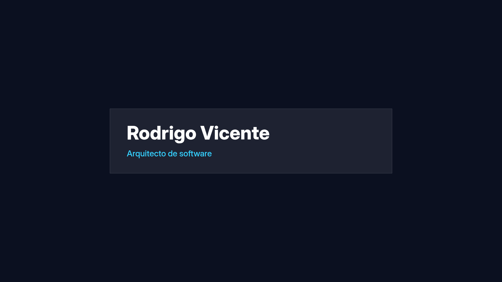

# CHG-0044 visual renderer observation

This evidence observes the two `identity.announce-person` surfaces produced by the
compiled OverlayKit pipeline and rendered by the real production client at the
declared 1920 by 1080 design space.




`report.json` binds each screenshot to its program, bundle, compilation receipt,
Preview revision, pixel metrics, critical text bounds, safe area and SHA-256 hash.
The browser proof is reproducible with:

```bash
npm run proof:visual
```

Normal runs write to the ignored `artifacts/visual-proof/` directory. The images in
this directory are the review sample produced for CHG-0044. They demonstrate real
renderer output, interpolation, geometry and pixel presence; they are not human
acceptance of visual quality, motion, branding or every capture environment.
